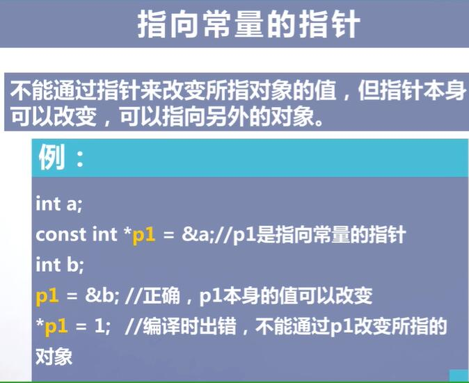
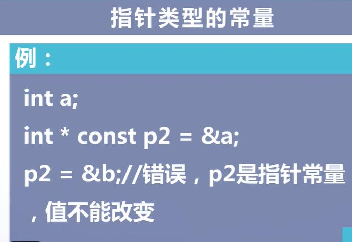

				指针  
```
#include <iostream>
using namespace std;

int main(){
    int i=1;
    int *point_i1;
    point_i1=&i;
    cout<<point_i1<<endl;
}
```

```
#include <iostream>
using namespace std;

int main(){
    void *pv;
    int i=5;
    pv=&i;
    int *pint=static_cast<int *>(pv);
    cout<<"*pint="<<*pint<<endl;
    return 0;
}
```



